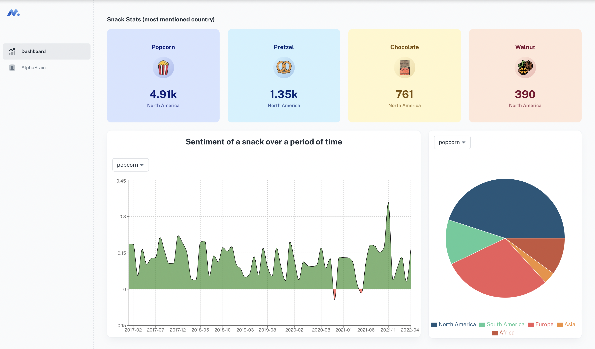

# NLP Hackathon - Analysis of Snacks

## Description
The source code for a demonstration website created during Amplyfi's NLP Hackathon challenge can be found in this GitHub repository. The project is centered around conducting various analyses on different varieties of snacks, and the website also incorporates a feature called "AlphaBrain," which allows users to ask snack-related questions and receive answers from the website. The code is available for consultation and future enhancements.

## Team

- [@bilal-mustafa10](https://github.com/bilal-mustafa10)
- [@sethupavan12](https://github.com/sethupavan12)

